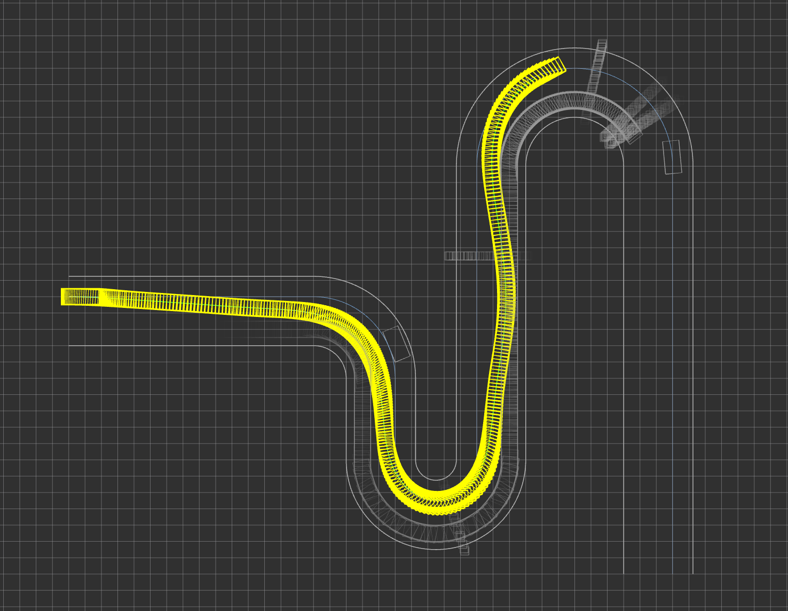

# Cartesian Planner ROS Package

C++/ROS Source Codes for "Autonomous Driving on Curvy Roads without Reliance on
Frenet Frame: A Cartesian-based Trajectory Planning Method" published in IEEE Trans.
Intelligent Transportation Systems by Bai Li, Yakun Ouyang, Li Li, and Youmin Zhang.



## Installation

### Building dependencies

1. Build linear solver Mumps **or** HSL

    1. Build mumps
       ```shell
       git clone https://github.com/coin-or-tools/ThirdParty-Mumps.git --depth=1
       cd ThirdParty-Mumps
       ./get.Mumps
       ./configure
       make
       sudo make install
       ```

    2. Build HSL **(recommended for better performance)**
       ```shell
       git clone https://github.com/coin-or-tools/ThirdParty-HSL.git --depth=1
 
       # Obtain a tarball with HSL source code from http://www.hsl.rl.ac.uk/ipopt/ and unpack this tarball
       gunzip coinhsl-x.y.z.tar.gz
       tar xf coinhsl-x.y.z.tar
 
       # Rename the directory `coinhsl-x.y.z` to `coinhsl`, or set a symbolic link:
       ln -s coinhsl-x.y.z coinhsl
 
       ./configure
       make
       sudo make install
       ```


1. Build and install [IPOPT](https://github.com/coin-or/Ipopt)

   ```shell
   sudo apt install wget unzip gfortran liblapack-dev patch pkg-config libmetis-dev
   wget https://github.com/coin-or/Ipopt/archive/refs/heads/stable/3.14.zip
   unzip 3.14.zip && cd Ipopt-stable-3.14/
   ./configure && make -j4
   sudo make install
   ```

2. Build and install [CASADi](https://github.com/casadi/casadi)
   ```shell
   wget https://github.com/casadi/casadi/releases/download/3.5.5/casadi-3.5.5-1.tar.gz
   tar -zxvf casadi-3.5.5-1.tar.gz
   cd casadi-3.5.5.1
   mkdir build && cd build
   cmake .. -DWITH_IPOPT=ON -DWITH_EXAMPLES=OFF
   make -j4
   sudo make install
   sudo ldconfig
   ```

3. Clone repository to any catkin workspace and compile workspace

   ```shell
   cd ~/catkin_ws/src
   git clone https://github.com/libai1943/CartesianPlanner.git cartesian_planner
   cd .. && catkin_make
   source devel/setup.bash
   ```

## Example


https://user-images.githubusercontent.com/85840949/150943617-f949d10d-c1be-424f-9530-1a21a5c67eef.mp4


Random test case with 6 pedestrians, 3 moving vehicles and 2 static vehicles.

```shell
roslaunch cartesian_planner pedestrian_test.launch
```

**Click anywhere in Rviz window with the `2D Nav Goal` Tool to start planning.**


## Acknowledgement

[CASADi](https://github.com/casadi/casadi)

Special thanks to [Baidu Apollo](https://github.com/ApolloAuto/apollo) for common math libraries

---

Copyright (C) 2022 Bai Li and Yakun Ouyang

Users must cite the following article if they use the source codes to conduct simulations in their new publications.
Bai Li, Yakun Ouyang, Li Li, and Youmin Zhang, “Autonomous driving on curvy roads without reliance on Frenet frame: A Cartesian-based trajectory planning method,” IEEE Transactions on Intelligent Transportation Systems, vol. 23, no. 9, pp. 15729 - 15741, 2022. available at https://doi.org/10.1109/TITS.2022.3145389
