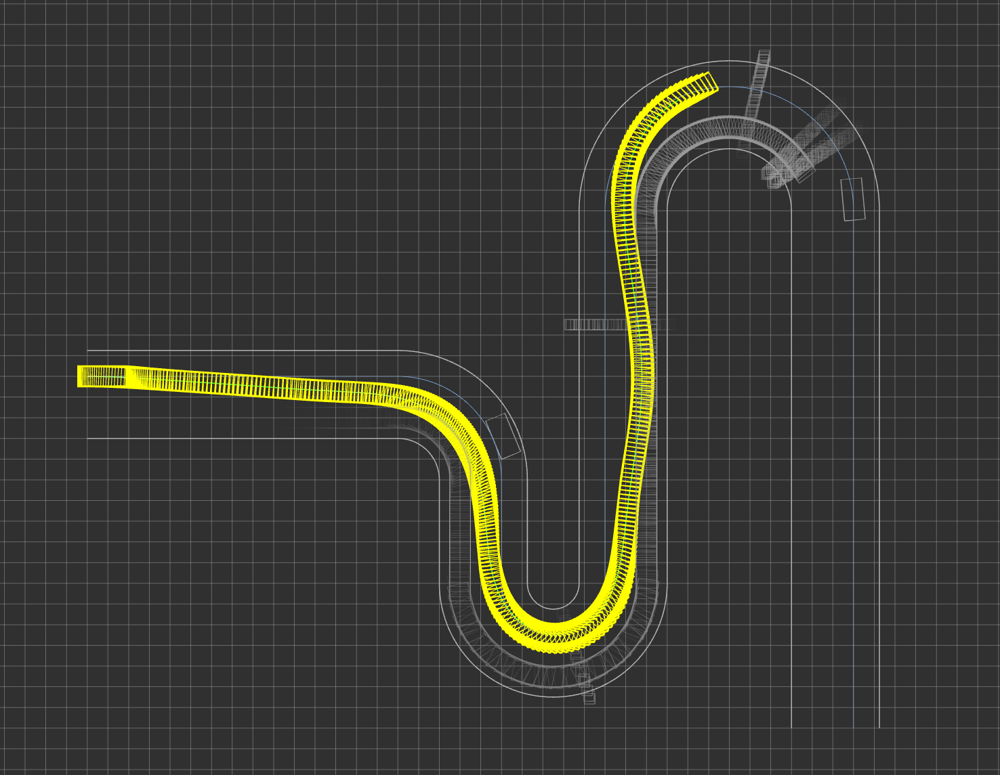

# Cartesian Planner ROS Package

C++/ROS implementation of the Cartesian-space trajectory planning method proposed in:

> **B. Li, Y. Ouyang, L. Li, and Y. Zhang**,  
> “Autonomous driving on curvy roads without reliance on Frenet frame: A Cartesian-based trajectory planning method,”  
> *IEEE Transactions on Intelligent Transportation Systems*, vol. 23, no. 9, pp. 15729–15741, 2022.  
> DOI: [10.1109/TITS.2022.3145389](https://doi.org/10.1109/TITS.2022.3145389)

The planner is designed for autonomous driving on **curved roads with static and moving obstacles**. Its main purpose is to avoid constructing the final trajectory optimization problem in a Frenet coordinate system. Instead, the vehicle states, motion equations, collision-related constraints, and trajectory optimization are formulated directly in the **Cartesian plane**.



---

## Overview

Frenet-frame planners are widely used for structured-road autonomous driving because they simplify road-relative trajectory generation. However, on roads with large curvature, rapidly changing geometry, or complex obstacle configurations, transforming the planning problem into the Frenet frame may introduce additional geometric processing and coordinate-dependent difficulties.

This project implements an alternative planning framework in which the main trajectory optimization is carried out directly with Cartesian states such as

```text
x, y, heading, velocity, steering angle, acceleration, steering rate
```

while the road reference is used to provide road geometry and to guide the generation of a coarse trajectory.

The implemented planner follows a two-stage structure:

```text
Road reference + static/dynamic obstacles
                  |
                  v
        Dynamic Programming
        coarse trajectory
                  |
                  v
     Cartesian corridor generation
                  |
                  v
   Iterative trajectory optimization
        CasADi + Ipopt
                  |
                  v
       Optimized trajectory
```

The first stage rapidly generates a collision-aware coarse trajectory. The second stage progressively refines this trajectory through nonlinear optimization while enforcing vehicle-motion and collision-related constraints.

---

## Key Idea

### 1. Coarse trajectory generation

`DpPlanner` first searches for a coarse collision-free trajectory.

The search uses the road reference to construct longitudinal and lateral samples and evaluates candidate transitions according to several criteria, including:

- collision with static and dynamic obstacles;
- distance from the road reference;
- lateral motion;
- variation in lateral motion;
- deviation from nominal longitudinal velocity; and
- variation in longitudinal motion.

The resulting path serves primarily as a **good initial trajectory for subsequent optimization**.

Although reference-line coordinates are used internally in this coarse search stage, the final optimal-control problem is **not formulated by transforming the vehicle dynamics into a Frenet frame**.

---

### 2. Cartesian trajectory optimization

The coarse solution is converted into a full initial guess for the nonlinear optimization problem.

The optimization variables include

```text
x
y
theta
v
phi
a
omega
jerk
```

together with Cartesian positions associated with front and rear vehicle representations.

The vehicle motion is directly expressed in Cartesian coordinates. The implementation optimizes trajectory tracking and motion smoothness while progressively reducing violation of the softened nonlinear motion relations.

The objective includes terms associated with:

- Cartesian position deviation from the coarse trajectory;
- heading deviation;
- jerk;
- steering-rate variation; and
- violation of the nonlinear vehicle-motion equations.

The penalty on nonlinear infeasibility is increased iteratively until the prescribed tolerance is satisfied.

---

### 3. Iteratively updated collision corridors

Collision avoidance is incorporated through Cartesian spatial corridors.

At every optimization iteration, the latest trajectory estimate is used to regenerate collision-free boxes around representative front and rear positions of the ego vehicle:

```text
                 vehicle
        +-----------------------+
        |                       |
        |     o           o     |
        |    rear        front  |
        |                       |
        +-----------------------+
```

The two representative positions are associated with vehicle-enclosing disks. Around each representative point, an axis-aligned collision-free box is expanded until nearby road boundaries or obstacles prevent further expansion.

The optimization then constrains the corresponding Cartesian variables inside these boxes.

Because the corridors are reconstructed around the newest trajectory estimate, the optimization follows an iterative pattern:

```text
initial trajectory
       |
       v
construct corridors
       |
       v
solve Cartesian NLP
       |
       v
update trajectory
       |
       v
reconstruct corridors
       |
       v
solve again
       |
      ...
```

This allows a computationally convenient collision representation to be progressively adapted to the optimized trajectory.

---

## Static and Dynamic Obstacles

The environment module supports both static and time-varying obstacles.

### Static obstacles

Static obstacles are represented as polygons and checked together with road boundaries.

### Dynamic obstacles

A dynamic obstacle contains a polygonal footprint and a predicted time-parameterized trajectory.

Conceptually:

```text
Obstacle footprint
       +
predicted poses over time
       |
       v
polygon occupied at time t
```

During planning, collision checks query the obstacle configuration corresponding to each trajectory time instant.

The example scenario contains:

- **6 pedestrians**;
- **3 moving vehicles**; and
- **2 static vehicles**.

---

## Code Structure

The core implementation is organized as follows:

```text
CartesianPlanner/
│
├── src/
│   ├── cartesian_planner_node.cpp
│   │   ROS interface and planning trigger
│   │
│   └── cartesian_planner/
│       ├── cartesian_planner.cpp
│       │   Main planning pipeline
│       │
│       ├── dp_planner.cpp
│       │   Dynamic-programming coarse trajectory generation
│       │
│       ├── trajectory_optimizer.cpp
│       │   Iterative optimization and corridor construction
│       │
│       ├── trajectory_nlp.cpp
│       │   CasADi/Ipopt nonlinear programming formulation
│       │
│       ├── environment.cpp
│       │   Road, static-obstacle and dynamic-obstacle handling
│       │
│       ├── discretized_trajectory.cpp
│       │   Trajectory interpolation and reference operations
│       │
│       ├── math/
│       │   Geometry and mathematical utilities
│       │
│       └── visualization/
│           RViz visualization utilities
│
├── include/cartesian_planner/
│   ├── cartesian_planner.h
│   ├── cartesian_planner_config.h
│   ├── dp_planner.h
│   ├── trajectory_optimizer.h
│   ├── trajectory_nlp.h
│   ├── environment.h
│   ├── discretized_trajectory.h
│   └── vehicle_param.h
│
├── script/
│   ├── reference_publisher.py
│   │   Generates random road/obstacle test scenarios
│   │
│   ├── pickle_publisher.py
│   │   Loads the predefined example scenario
│   │
│   └── example.pickle
│       Pre-generated demonstration case
│
├── launch/
│   ├── pedestrian_test.launch
│   └── random_pedestrian_test.launch
│
├── msg/
│   Custom ROS messages for road and obstacle information
│
├── config/
│   RViz configuration
│
└── resources/
    Images and demonstration material
```

---

## Main Modules

### `cartesian_planner_node.cpp`

This is the main ROS node.

It subscribes to:

```text
/center_line
/obstacles
/dynamic_obstacles
/move_base_simple/goal
```

The first three topics provide the planning environment.

The RViz `2D Nav Goal` message is used to trigger trajectory planning.

> **Note:** In this demo, the position clicked with `2D Nav Goal` is used as a planning trigger; the clicked coordinates themselves are not used as a destination state.

The demo initializes the ego state in the node and plans forward over a fixed time horizon.

---

### `cartesian_planner.cpp`

This file implements the high-level planning pipeline:

```cpp
DpPlanner::Plan(...)
        ↓
TrajectoryOptimizer::OptimizeIteratively(...)
        ↓
construct final DiscretizedTrajectory
```

The coarse DP trajectory is visualized in cyan, while the final optimized trajectory is visualized in green.

---

### `dp_planner.cpp`

Implements dynamic-programming-based coarse trajectory generation.

The DP state space samples:

- time;
- longitudinal progression; and
- lateral displacement.

Candidate transitions are evaluated for collision and motion quality.

The cost function penalizes, among other terms:

```text
lateral displacement
lateral variation
temporal lateral variation
deviation from nominal velocity
longitudinal velocity variation
collision
```

After the last DP layer is evaluated, the minimum-cost state is selected and the predecessor chain is traced backward to construct the coarse trajectory.

---

### `trajectory_optimizer.cpp`

Implements the iterative refinement procedure.

Its main entry is:

```cpp
OptimizeIteratively(...)
```

The procedure roughly performs:

```text
coarse trajectory
      ↓
construct full-state initial guess
      ↓
generate front/rear Cartesian corridors
      ↓
solve NLP
      ↓
check nonlinear infeasibility
      ↓
increase penalty and repeat if necessary
```

The default maximum number of optimization iterations is defined in:

```cpp
config_.opti_iter_max
```

---

### `trajectory_nlp.cpp`

Defines and solves the nonlinear trajectory optimization problem using **CasADi** and **Ipopt**.

The main optimization states are:

```cpp
x
y
theta
v
phi
a
omega
jerk
```

and additional Cartesian variables represent the front and rear vehicle reference locations:

```cpp
xf
yf
xr
yr
```

The nonlinear vehicle-motion relations are included through a penalty-based iterative formulation.

The implementation also imposes bounds on important physical quantities such as:

- longitudinal velocity;
- acceleration;
- steering angle; and
- steering angular velocity.

---

### `environment.cpp`

Maintains the planning environment.

Its main responsibilities include:

- road-boundary construction;
- static polygonal obstacles;
- moving-obstacle trajectories;
- time-dependent collision checks; and
- environment visualization.

Dynamic obstacles are queried according to planning time, allowing the planner to consider predicted future occupancy rather than only the current obstacle positions.

---

### `reference_publisher.py`

Generates demonstration environments.

The script can construct a road from combinations of:

```text
straight segments
circular arcs
```

and randomly generate:

- static vehicles;
- moving vehicles; and
- pedestrians.

The random launch example uses this script to generate a new environment each time.

---

### `pickle_publisher.py`

Loads the predefined environment stored in:

```text
script/example.pickle
```

and publishes the road reference and obstacle information through ROS.

This is the recommended entry for reproducing the example shown in the repository.

---

## Default Configuration

Most planner parameters are defined in:

```text
include/cartesian_planner/cartesian_planner_config.h
```

Some important default values are:

```cpp
nfe = 320;                    // number of discretization points
tf = 16.0;                    // planning horizon [s]
dp_nominal_velocity = 10.0;  // nominal DP velocity [m/s]
opti_iter_max = 5;           // maximum optimization iterations
opti_w_penalty0 = 1e5;       // initial dynamics penalty
opti_alpha = 10.0;           // penalty multiplier
opti_varepsilon_tol = 1e-4;  // feasibility tolerance
```

Vehicle parameters are located in:

```text
include/cartesian_planner/vehicle_param.h
```

The default vehicle dimensions include:

```cpp
wheel_base        = 2.80 m
front_hang_length = 0.96 m
rear_hang_length  = 0.929 m
width             = 1.942 m
```

The default maximum velocity is:

```cpp
max_velocity = 12.0 m/s
```

These files are convenient starting points for users who want to test different vehicle models, planning horizons, or optimization settings.

---

## Installation

### Requirements

- ROS Melodic or later
- Python 3
- C++11-compatible compiler
- LAPACK
- METIS
- CasADi
- Ipopt

CasADi is automatically downloaded and built by the provided CMake configuration. The repository currently uses **CasADi 3.6.3** and enables Ipopt during the build.

Install the packages required by Ipopt:

```shell
sudo apt-get install gcc g++ gfortran git patch wget pkg-config liblapack-dev libmetis-dev
```

Clone the repository into a catkin workspace:

```shell
cd ~/catkin_ws/src
git clone https://github.com/libai1943/CartesianPlanner.git cartesian_planner

cd ~/catkin_ws
catkin_make

source devel/setup.bash
```

---

## Optional: HSL Linear Solver

The planner can use the **Harwell Subroutine Library (HSL)** with Ipopt for improved numerical performance.

Without HSL, the current implementation falls back to the **MUMPS** linear solver.

With HSL enabled, the code selects **MA27**.

Clone the HSL build helper:

```shell
git clone https://github.com/coin-or-tools/ThirdParty-HSL.git
```

Obtain an HSL source archive and unpack it:

```shell
tar -zxvf coinhsl-x.y.z.tar
```

Rename the directory to `coinhsl`, or create a symbolic link:

```shell
ln -s coinhsl-x.y.z coinhsl
```

Then build and install:

```shell
./configure
make
sudo make install
```

Create the Ipopt-compatible symbolic link:

```shell
sudo ln -s /usr/local/lib/libcoinhsl.so /usr/local/lib/libhsl.so
```

Rebuild the catkin workspace with HSL enabled:

```shell
cd ~/catkin_ws
catkin_make -DWITH_HSL=ON
```

---

## Example

The repository includes a predefined test case containing:

- 6 pedestrians;
- 3 moving vehicles; and
- 2 static vehicles.

Run:

```shell
roslaunch cartesian_planner pedestrian_test.launch
```

After RViz opens, select the **`2D Nav Goal`** tool and click anywhere in the RViz window to trigger planning.

### Demo Video

https://user-images.githubusercontent.com/85840949/150943617-f949d10d-c1be-424f-9530-1a21a5c67eef.mp4

The visualization shows the coarse trajectory, Cartesian collision corridors, optimized trajectory, ego vehicle motion, and time-varying obstacles.

---

## Generate a New Random Scenario

To generate a new random road/obstacle configuration and run the planner:

```shell
roslaunch cartesian_planner random_pedestrian_test.launch
```

This launch file calls:

```text
reference_publisher.py
```

with random static vehicles, moving vehicles, and pedestrians.

Because the obstacles are randomly generated, repeated executions can produce different planning scenarios.

---

## ROS Interfaces

The planner uses several custom message types:

```text
CenterLine.msg
CenterLinePoint.msg
Obstacles.msg
DynamicObstacle.msg
DynamicObstacles.msg
DynamicTrajectoryPoint.msg
```

They describe the reference road, road bounds, static obstacle polygons, and predicted trajectories of moving obstacles.

The main input topics are:

```text
/center_line
/obstacles
/dynamic_obstacles
```

Planning is triggered through:

```text
/move_base_simple/goal
```

which is conveniently generated by the RViz `2D Nav Goal` tool.

---

## Acknowledgement

This project uses [CasADi](https://github.com/casadi/casadi) for nonlinear optimization modeling and Ipopt as the NLP solver.

Special thanks to [Baidu Apollo](https://github.com/ApolloAuto/apollo) for common mathematical and geometry utilities adapted in this project.

---

## Citation

If you use this source code or the Cartesian trajectory planning method in your research, please cite the following paper:

> B. Li, Y. Ouyang, L. Li, and Y. Zhang,  
> “Autonomous driving on curvy roads without reliance on Frenet frame: A Cartesian-based trajectory planning method,”  
> *IEEE Transactions on Intelligent Transportation Systems*, vol. 23, no. 9, pp. 15729–15741, 2022.  
> DOI: [10.1109/TITS.2022.3145389](https://doi.org/10.1109/TITS.2022.3145389)

### BibTeX

```bibtex
@article{li2022cartesian,
  title={Autonomous driving on curvy roads without reliance on Frenet frame: A Cartesian-based trajectory planning method},
  author={Li, Bai and Ouyang, Yakun and Li, Li and Zhang, Youmin},
  journal={IEEE Transactions on Intelligent Transportation Systems},
  volume={23},
  number={9},
  pages={15729--15741},
  year={2022},
  doi={10.1109/TITS.2022.3145389}
}
```

---

## License

This project is distributed under the **GNU General Public License v3.0 (GPL-3.0)**.

See [LICENSE](LICENSE) for details.

---

Copyright © 2022 Bai Li and Yakun Ouyang.
